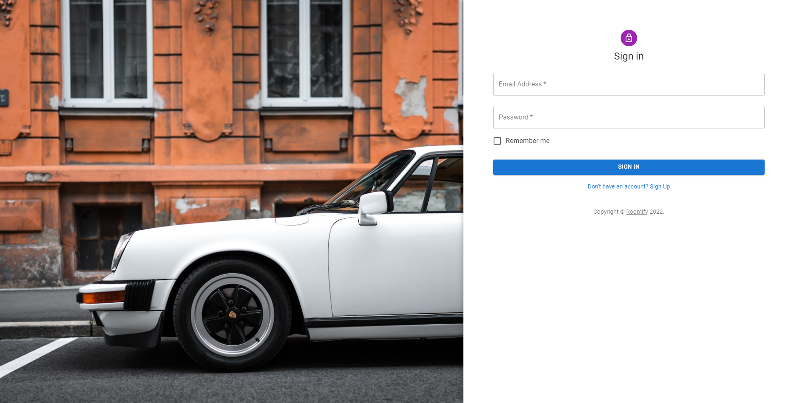
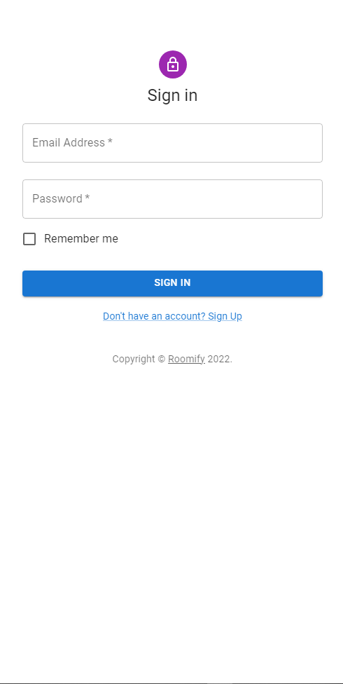

# Capstone Backend

> This is the frontend for our capstone project.

### Desktop Version
> 

### Mobile Version
<p align="center">
  
</p>

## Built With

- React
- Redux
- Material UI
- Slick Carousel


## Getting Started
To have a local copy of the code, follow the following steps:

### Prerequisites
- A web browser (like Google Chrome, Opera...).
- A code editor (like Atom, VScode...).

### Setup
To setup the project locally: clone the repository using:

```
https://github.com/Andyveloper/Roomify-app.git
```

### Install dependencies
run : `npm install`

### Build the app
run: `npm run build`

### Run the app
run: `npm start`

## Live demo
[Netlify](https://roomify-app.netlify.app/)
## Kanban board
[Link to Kanban board](https://github.com/andgarzonmal/capstone-project-back-end/projects/1)
[Initial state of Kanban board](https://github.com/andgarzonmal/capstone-project-back-end/issues/23)
We are 5 people.
## Authors

👤 **Mauricio Cantillo Moreno**

- GitHub: [@Andyveloper](https://github.com/Andyveloper)
- Twitter: [@Andyveloper](https://twitter.com/MauroCantillo_)
- LinkedIn: [@Andyveloper](https://www.linkedin.com/in/mauricio-cantillo-moreno/)

👤 **Andres Garzon Maldonado**
- GitHub: [@andrgarzonmal](https://github.com/andrgarzonmal)
- LinkedIn: [andres-garzon-maldonado](https://www.linkedin.com/in/andres-garzon-maldonado-951a2a180/)

👤 **Dafne Azzolina**

- GitHub: [@Daf98](https://github.com/Daf98)
- Twitter: [@dafne_azzolina](https://twitter.com/dafne_azzolina)
- LinkedIn: [dafne-azzolina](https://www.linkedin.com/in/dafne-azzolina/)

👤 **Dino Quispe**

- GitHub: [@dqarias](https://github.com/Daf98)
- Twitter: [@DinoRonald7](https://twitter.com/DinoRonald7)
- LinkedIn: [Dino Quispe](https://www.linkedin.com/in/dino-ronald-quispe-arias-8ba72174/)

👤 **Owoeye Olaoluwa (Olamarx)**

- GitHub: [@githubhandle](https://github.com/Olamarx)
- Twitter: [@twitterhandle](https://twitter.com/Owoeye0laoluwa)
- LinkedIn: [LinkedIn](https://www.linkedin.com/in/olaoluwa-owoeye-617702162/)
- Facebook: [Facebook](https://web.facebook.com/olaoluwa.owoeye.39)


## 🤝 Contributing

Contributions, issues, and feature requests are welcome!

Feel free to check the [issues page](../../issues/).


## Show your support

Give a ⭐️ if you like this project!

## 📝 License

This project is [MIT](./MIT.md) licensed.
